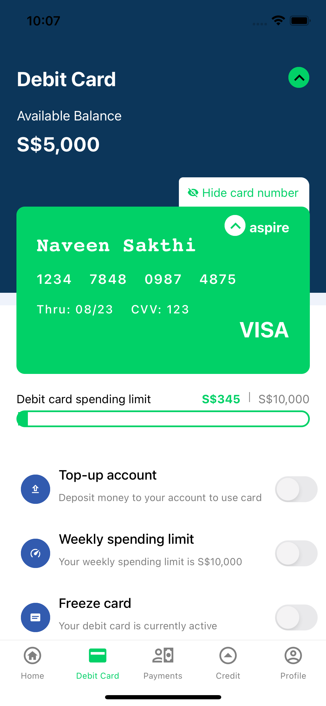
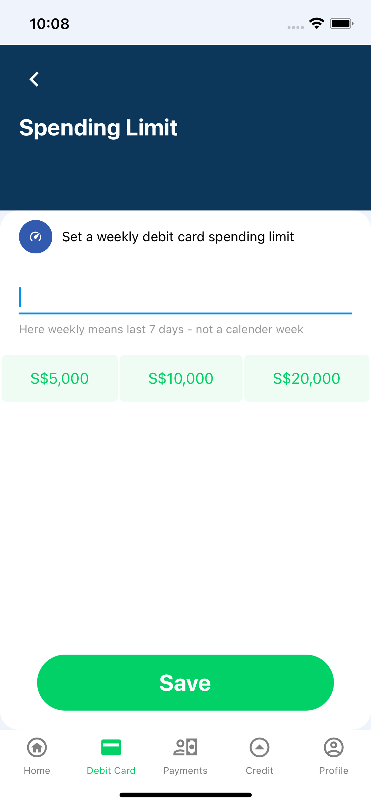

<h1>Finance App (Aspire)</h1>

## Installation

You can simply clone the project

```ruby
git clone https://github.com/rootwitstudio/fin_app.git
```

## Step By Step Guide

### Install Pods (iOS Only)

- yarn install
- cd ios && pod install
- cd .. && react-native run-ios/android

# What's Included?

- Redux
- Redux Saga
- React Navigation V6
- HTTP Network Management (Axios)
- Generic React Hooks API Request Service
- prettier & Eslint
- Jest (Unit Testing)
- Typescript
- Reactotron (Debugging)
- React Hooks
- Function Component

<hr>

# Components

- Debit Card
- Switch
- Progress Bar


# Pages

- Debit card Page
- Spending Limit Page


# Description

- Debit card page,which shows debit card details along with settings option.
- As of now debit card limit set option alone enabled
- If you enable the limit ,then it redirected to spending limit set page.There you can the amount limit
- Based on the limit and current spent ,Progress bar will load.


#TODO
- Colors need to be moved into separate Palette file
- Need handle memo and callback for more optimization
- Need to use dispatch and use-selector instead connect
- Need to add props interface for all components
- Need to write unit testing for all component
- Need to add custom font (already custom icomoon icon added)


 


